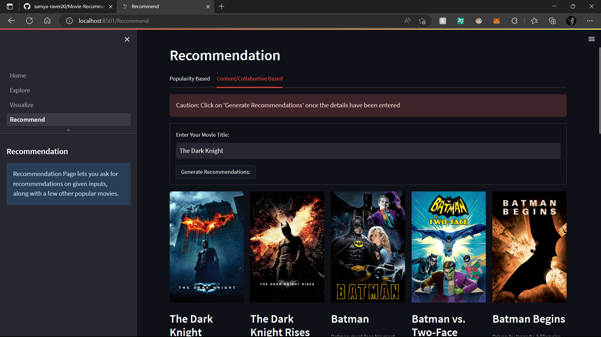

# &#128249; Movie-Recommendation-System



This projects uses MovieLens 25M Dataset along with TMDb API to explore and visualize trends in movies. It also contains a content based &amp; collaborative based recommendation model using Vectorizer and SVD respectively.

<br>


> For detailed guides, steps and instructions, check out: [Colab Notebook](https://colab.research.google.com/drive/1J6hg-FvonxtgzQ71MNr11md5gFtiqmZV?usp=share_link)

<br>


This streamlit app contains the following sections:
* &#128393; Explore: This sections lets the user explore all the dataframes required for the webapp.

* &#128270; Visualize: This section lets the user visualize the various trends in the dataset, like popularity of the movies, seggregation of the movies into genres/keywords, the vote distribution statistics and the coappearance network of all cast members based on user input.

* &#127909; Recommendation: This section lets the user ask for Content Based as well as Collaborative Based recommendations, after greeting the user with popular movies specific to a given genre as well as over the entire dataset.

<br>

```
modify the env.config file to store the TMDb API Key
```

<br>

<div>
    <br>
    <br>
    <br>
    <div align="center">
    ~ made with ~
    </div>
    <br>
    <br>
    <div>
        <a href='https://docs.streamlit.io/library/get-started' style='padding-right: 10%;'>
            
        </a>
        <a href='https://developers.themoviedb.org/3/getting-started/introduction' style='padding-right: 20%'>
            
        </a>
        <a href='https://colab.research.google.com/drive/1J6hg-FvonxtgzQ71MNr11md5gFtiqmZV?usp=share_link'>
            
        </a>
    </div>
</div>